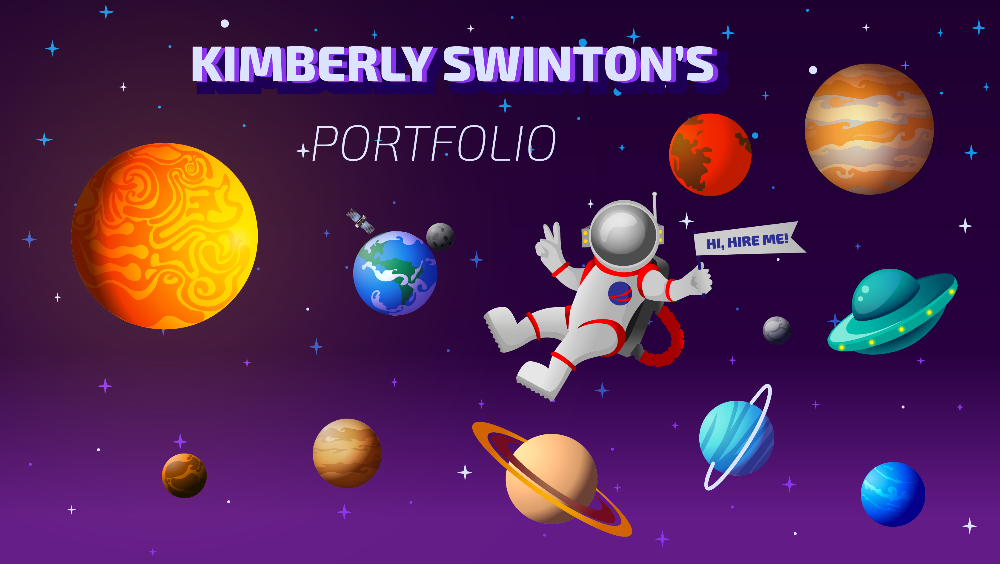

# Welcome to my Portfolio's README!

### What I used to build:
- [React JS](https://reactjs.org/) ⚛️
- [Styled Components](https://styled-components.com/) 💅🏾
- [React Spring](https://react-spring.io/) ⚾️
- [Font Awesome](https://fontawesome.com/) 🦄
- [React Hook Form](https://react-hook-form.com/) 📑
- [EmailJS](https://www.emailjs.com/) 📩
- [Adobe Illustrator](https://www.adobe.com/products/illustrator.html?sdid=KKQML&mv=search&ef_id=Cj0KCQiA3rKQBhCNARIsACUEW_Yh7dlG8dqV0vHNKzruduZMxZJhgz5zqjA5W4656evzL3GzCtPrqwUaAm67EALw_wcB%253AG%253As&s_kwcid=AL%213085%213%21442365417815%21e%21%21g%21%21adobe%2520illustrator%211711729586%2170905759510&gclid=Cj0KCQiA3rKQBhCNARIsACUEW_Yh7dlG8dqV0vHNKzruduZMxZJhgz5zqjA5W4656evzL3GzCtPrqwUaAm67EALw_wcB) 🎨
- [Adobe Xd](https://www.adobe.com/creativecloud/business/teams.html?sdid=B16P3W9X&mv=search&ef_id=Cj0KCQiA3rKQBhCNARIsACUEW_b3Y6Jy3uPgB9cT7APVEO-UWqn3Yg1EDjiKkGlmEkFD3PkgDBRBW1oaAqBLEALw_wcB:G:s&s_kwcid=AL!3085!3!566814725673!e!!g!!adobe%20xd!15482932269!136265041128) 👩🏾‍🎨
---
### Planning

This website has gone through a lot of changes... for the better of course! 

#### Portfolio Inspiration
The inspiration for this entire portfolio came from my love of purple and space. My goal was to challenge myself by creating something that I've never seen before. I knew I wanted to use the parallax effect after being inspired by someone's post I saw on Linkedin. I didn't even know what a "parallax effect" was until I started reading the post's comments. I lurked on his Linkedin to find his Github so that I could dissect his code, but it wasn't even in his GitHub.

That's when I started Googling `parallax effect in react` and stubbled upon React Spring!

***(To be continued...)***

#### Portfolio LAYOUT Inspiration
The inspiration for the current layout came from [HTML5UP's website](https://html5up.net/paradigm-shift). I was going to use that particular template and implement what I already had, but at the time I was in a rush to complete my portfolio. 

SO! I decided it was best to use what I already had instead of trying to implement my code into something that would have probably taken me longer than expected. 

---
### The Original Layout

Originally the layout was created in Adobe Illustrator. Now, I'm currently working on making it properly in Adobe Xd. Thankfully I could just copy and paste everything in there.

***(To be continued...)***

